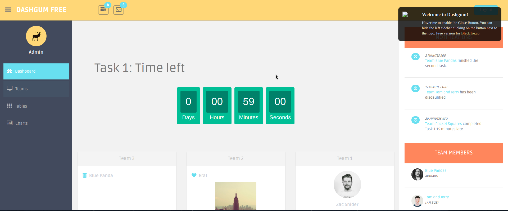
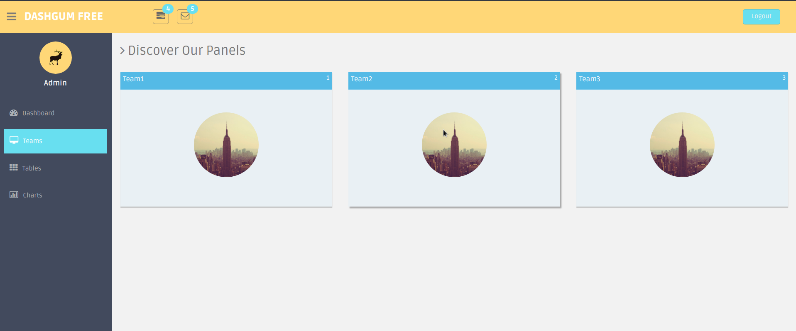

# Treasure Hunt Web App
Built in the one day round of Codeshastra 2017, the web app uses a QR Code Scanner that is used to obtain a clue for the treasure hunt and REST API was used to communicate between the mobile app and web interface.

The web interface is an admin panel used by the organizers to keep a track of the players using their geo-location. It also keeps score of the team based on time.

## Tech Stack
- Django Backend
- HTML, CSS and Bootstrap
- REST API communicating with an Android Application
- Google Places API

## Screenshots

*Dashboard*

*Team Panes*

## How to run the web application
1. Clone the repository
2. Install the dependencies with `pip install -r requirements.txt`. Use `python3` for your virtual environment. *(Note: It is recommended to use a Python virtual environment, so as to not interfere with your system installed libraries. The link on how to work with virtual environments [here](https://python-docs.readthedocs.io/en/latest/).)*
3. Move to the `great_game` directory and run the command `python3 manage.py runserver`
